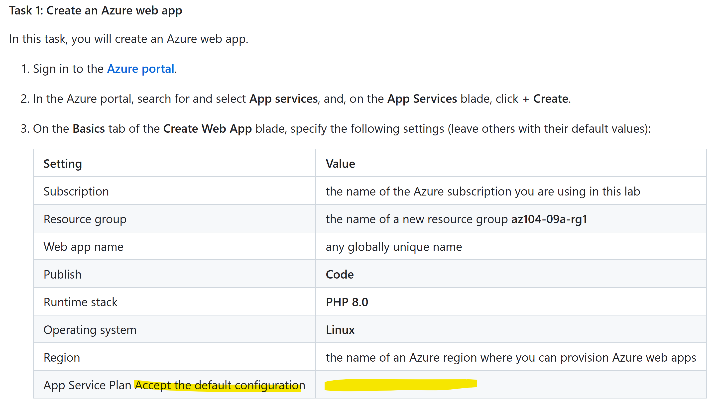
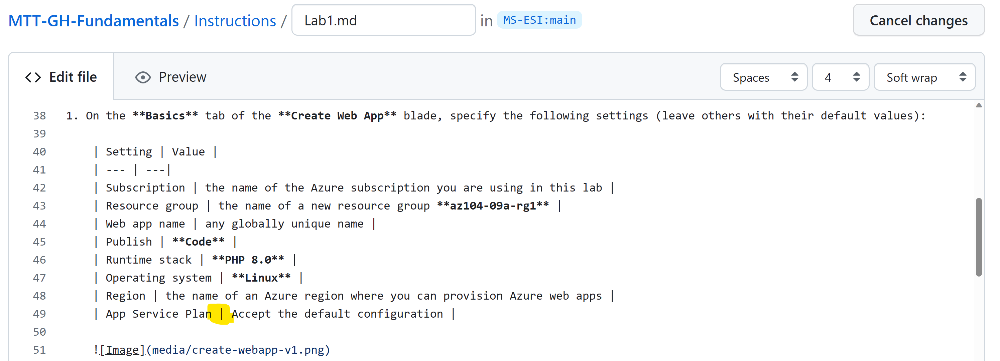
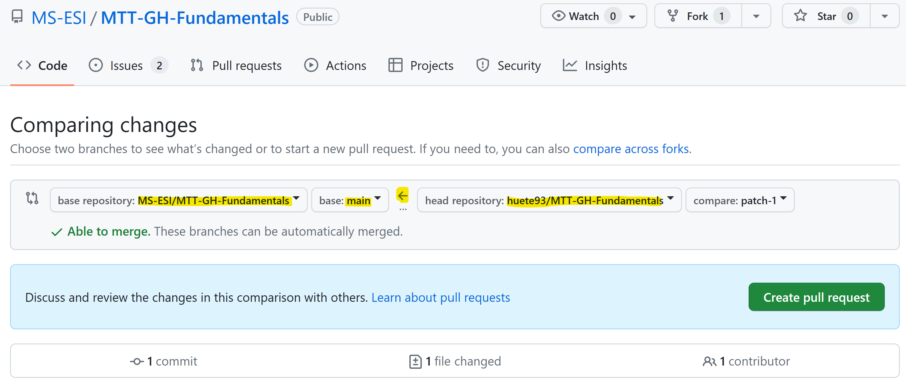
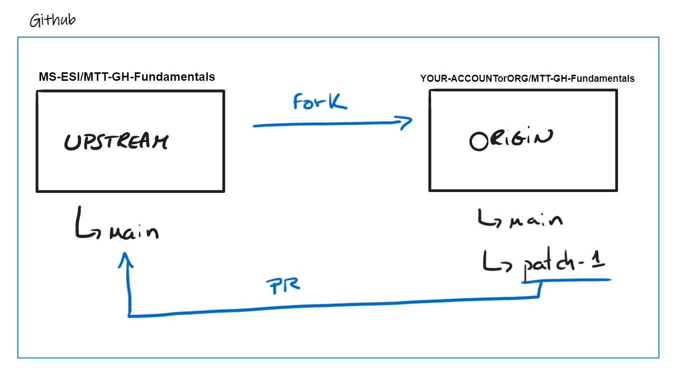

### Lab 2: Create a Pull Request (Beginner)
You are going to create a PR from a forked repo. This is the most common way to collaborate on a public repository (as many OSS projects do). You will need to create a fork of the source repo (upstream), make changes to a branch in the fork, and then create a PR from the fork to the upstream repo (source).

Before starting, lets cover some basic concepts:

- A repository being public **does NOT mean anyone can make changes to it**. You need to be granted permissions to do so or **you need to propose changes using a fork of the source repo for experimentation**. In the case of the MOC content, only the Content Owner (Content Devs in a real life scenario) has permissions to make changes to the original repo. MTTs need to collaborate using PRs.
- A **Pull Request (PR)** is a request to merge changes from a branch in a forked repo to a branch in the source repo. The PR is used to propose changes to the source repo. The PR is a conversation between the contributor and the Content Owner. The Content Owner will review the PR and collaborate with the contributor to make sure the PR is ready to merge. The PR is the most common way to collaborate in GitHub.
- In your case you will have:
    - **MS-ESI/MTT-GH-Fundamentals repo (Upstream)**: The **source repo**. The "stable" version of the content. The repo that contains the original content.
    - **YOUR-ORG-OR-ACCOUNT/MTT-GH-Fundamentals repo (Fork)**: The **forked repo**. A copy of the source repo in your GitHub account. You will be making changes to this repo.
    

    

#### Exercise

1. Go to the MS-ESI/MTT-GH-Fundamentals repo (if not there already). Lets try to make a change to the source repo to see what happens.
1. In **Code** tab, go to the `Instructions/WebApp-Lab.md` file. Look for the following table syntax issue reported on previous lab. 

    

1. Open the editor clicking on the edit icon (pencil, top right corner). You will see the following warning message:

    

1. The warning explains how a fork has been created for you to experiment on your proposed changes (as you do not have write permissions to the source repo). The proposed changes will be made in a branch in your forked repo **(default name given, for example, "patch-1")**. You will need to create a PR from your fork to the source repo to propose the changes.

1. Start by proposing the change to the table format. You can use the **Preview** tab to see how the table will look like once the changes are applied.

    

1. Go to the bottom and on the **Propose changes** section, provide a descriptive message for the commit. For example: **Fix table format**. Leave the **extended description** empty. Click on **Propose changes**.
1. At this point you have made the **changes to a branch (default name given, for example, "patch-1") in your forked repo**. You need to create a PR from your fork to the source repo to propose the changes. The GitHub UI will guide you through the process of opening a PR from your fork to the source repo.

    

    

1. As you can see in the image above, GitHub is proposing you to open a PR **from** a branch your forked repo **to** the default branch of the source repo. You can change the source and target branches if needed. Click on **Create pull request**.

1. In the **Open a pull request** window, provide a descriptive title for the PR. For example: **Fix table format in WebApp-Lab.md**. Provide a description to the PR. For example:

    ```The table format is not correct. The table is not rendered correctly.```    
1. As this PR is trying to fix and existing&reported issue, you can include a reference to the issue (use your Issue number #) in the PR description.**This is great to trace the status of the issue from both the Issue or PR (on the Development field of the items, right column)**. Include a reference to the issue in the PR description. For example:

    ```Fixes #2```

1. Click on **Create pull request**. Your PR should be created and look similar to the following [PR](https://github.com/MS-ESI/MTT-GH-Fundamentals/pull/3).

1. Now if you open the GH Issue from lab one, you will see a reference to the PR that fixes the issue. 

    